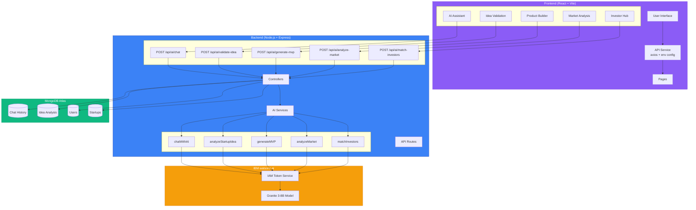

# System Architecture Diagram

## 🏗️ Full-Stack AI SaaS Architecture



## 🔄 Data Flow

### 1. Chat Flow (AI Assistant)
```
User Input → AIAssistant.jsx → API.post('/ai/chat')
    ↓
Backend: chatController → chatWithAI() → IBM Granite
    ↓
Save to ChatHistory → Return AI Response
    ↓
Display in Chat UI
```

### 2. Idea Validation Flow
```
User Idea → IdeaValidation.jsx → API.post('/ai/validate-idea')
    ↓
Backend: ideaValidationController → analyzeStartupIdea() → IBM Granite
    ↓
Parse Scores → Save to IdeaAnalysis → Return Analysis + Scores
    ↓
Display Results + Score Cards
```

### 3. MVP Generation Flow
```
User Input → ProductBuilder.jsx → API.post('/ai/generate-mvp')
    ↓
Backend: mvpGenerationController → generateMVP() → IBM Granite
    ↓
Save to IdeaAnalysis → Return MVP Plan
    ↓
Display Roadmap + Features
```

### 4. Market Analysis Flow
```
User Input → MarketAnalysis.jsx → API.post('/ai/analyze-market')
    ↓
Backend: marketAnalysisController → analyzeMarket() → IBM Granite
    ↓
Save to IdeaAnalysis → Return Market Insights
    ↓
Display Market Data + Competitors
```

### 5. Investor Matching Flow
```
User Profile → InvestorHub.jsx → API.post('/ai/match-investors')
    ↓
Backend: investorMatchController → matchInvestors() → IBM Granite
    ↓
Save to IdeaAnalysis → Return Investor Guidance
    ↓
Display Investor Recommendations
```

## 🗄️ Database Schema

### ChatHistory Collection
```javascript
{
  _id: ObjectId,
  userId: ObjectId (optional),
  sessionId: String (indexed),
  messages: [
    {
      role: "user" | "ai",
      content: String,
      timestamp: Date
    }
  ],
  createdAt: Date,
  updatedAt: Date
}
```

### IdeaAnalysis Collection
```javascript
{
  _id: ObjectId,
  userId: ObjectId (optional),
  idea: String,
  analysis: String,
  scores: {
    marketFit: Number (0-100),
    scalability: Number (0-100),
    riskLevel: "Low" | "Medium" | "High"
  },
  category: "idea_validation" | "mvp_generation" | "market_analysis" | "investor_match",
  createdAt: Date,
  updatedAt: Date
}
```

## 🔐 Environment Variables

### Backend (.env)
```
PORT=5000
MONGO_URI=mongodb+srv://...
JWT_SECRET=...
IBM_API_KEY=...
IBM_PROJECT_ID=...
```

### Frontend (.env)
```
VITE_API_URL=http://localhost:5000/api
```

## 🚀 API Endpoints

| Method | Endpoint | Purpose | Request Body |
|--------|----------|---------|--------------|
| POST | `/api/ai/chat` | Chat with AI | `{ message, sessionId, conversationHistory }` |
| POST | `/api/ai/validate-idea` | Validate startup idea | `{ idea }` |
| POST | `/api/ai/generate-mvp` | Generate MVP plan | `{ idea, targetAudience, timeline }` |
| POST | `/api/ai/analyze-market` | Market analysis | `{ industry, targetMarket }` |
| POST | `/api/ai/match-investors` | Investor matching | `{ startupProfile, fundingStage, industry }` |

## 📊 Response Formats

### Chat Response
```json
{
  "success": true,
  "response": "AI generated response...",
  "sessionId": "session_1234567890"
}
```

### Idea Validation Response
```json
{
  "success": true,
  "analysis": "Detailed analysis text...",
  "scores": {
    "marketFit": 85,
    "scalability": 78,
    "riskLevel": "Low"
  },
  "id": "64abc123..."
}
```

### MVP Generation Response
```json
{
  "success": true,
  "mvpPlan": "Detailed MVP plan..."
}
```

## 🔧 Technology Stack

### Frontend
- **Framework**: React 18 + Vite
- **Styling**: Tailwind CSS
- **Animation**: Framer Motion
- **HTTP Client**: Axios
- **State Management**: React Hooks

### Backend
- **Runtime**: Node.js
- **Framework**: Express.js
- **Database**: MongoDB Atlas
- **ODM**: Mongoose
- **AI**: IBM watsonx.ai (Granite 3-8B)

### DevOps
- **Version Control**: Git
- **Deployment**: Render (Backend), Vercel/Netlify (Frontend)
- **Environment**: Development + Production

## ⚡ Performance Optimizations

1. **Token Caching**: IBM access tokens cached for reuse
2. **Retry Logic**: Automatic retry on API failures (3 attempts)
3. **Timeout Handling**: 30-second timeout for AI requests
4. **Database Indexing**: Optimized queries with indexes
5. **Conversation Context**: Limited to last 10 messages
6. **Response Streaming**: Future enhancement for real-time responses

## 🛡️ Error Handling

1. **Frontend**: Try-catch blocks with user-friendly messages
2. **Backend**: Express async handler + custom error middleware
3. **IBM API**: Retry logic with exponential backoff
4. **Database**: Mongoose validation + error handling
5. **Network**: Axios interceptors for global error handling

## 📈 Scalability Considerations

1. **Horizontal Scaling**: Stateless backend design
2. **Database Sharding**: MongoDB Atlas auto-scaling
3. **Caching Layer**: Redis for future implementation
4. **Load Balancing**: Ready for multi-instance deployment
5. **CDN**: Static assets served via CDN
6. **API Rate Limiting**: Future implementation for production

---

**This architecture ensures:**
- ✅ Real-time AI responses
- ✅ Data persistence
- ✅ Scalable design
- ✅ Production-ready code
- ✅ Environment flexibility
- ✅ Comprehensive error handling